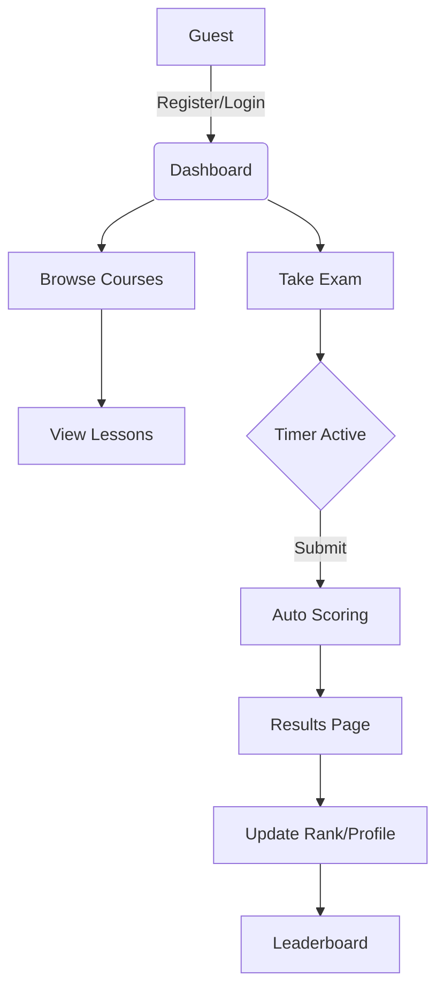

# Implementation Plan - IT Exams & Learning Platform

This document outlines the architectural design and implementation strategy for the IT Exams & Learning Platform.

## 1. System Architecture

The platform follows a decoupled architecture:
- **Backend**: Django & Django REST Framework (DRF).
- **Frontend**: React (Vite) with Tailwind CSS.
- **Database**: PostgreSQL.
- **Authentication**: JWT (JSON Web Tokens).

### Component Overview
- **Storage**: Local/S3 for media content.
- **Caching**: Redis (optional, for leaderboard performance).
- **Real-time**: WebSockets (optional, for live updates on leaderboard).

## 2. Database Design (PostgreSQL)

### Users & Profiles
- `CustomUser`: `email`, `username`, `avatar`, `total_score`, `rank`, `level`.

### Courses & Lessons
- `Course`: `id`, `title`, `slug`, `description`, `thumbnail`, `category`, `difficulty`.
- `Lesson`: `id`, `course_id`, `title`, `content` (text/rich-text), `video_url`, `order`.

### Exams & Assessments
- `Exam`: `id`, `course_id`, `title`, `description`, `duration_minutes`, `passing_score`, `is_active`.
- `Question`: `id`, `exam_id`, `text`, `code_snippet`, `points`, `type` (MCQ).
- `Choice`: `id`, `question_id`, `text`, `is_correct`.

### Tracking & Ranking
- `ExamAttempt`: `id`, `user_id`, `exam_id`, `score`, `time_spent`, `status` (completed/failed), `completed_at`.
- `Leaderboard`: (View or derived table) - Weekly, Monthly, All-time rankings.

## 3. API Endpoints (REST)

### Auth
- `POST /api/v1/auth/register/`
- `POST /api/v1/auth/token/` (Login)
- `POST /api/v1/auth/token/refresh/`

### Profile
- `GET /api/v1/profile/me/`
- `PATCH /api/v1/profile/me/`
- `GET /api/v1/profile/leaderboard/`

### Courses
- `GET /api/v1/courses/`
- `GET /api/v1/courses/{slug}/`
- `GET /api/v1/courses/{slug}/lessons/`

### Exams
- `GET /api/v1/exams/`
- `GET /api/v1/exams/{id}/`
- `POST /api/v1/exams/{id}/start/`
- `POST /api/v1/exams/{id}/submit/`

## 4. User Flow Diagram (Mermaid)

## 5. UI Structure (React Components)

### Layouts
- `MainLayout`: Sidebar, Navbar, Content area.
- `AuthLayout`: Centered containers for login/register.

### Pages
- `Dashboard`: User summary, current courses, recent activity.
- `CourseList`: Grid of course cards with filters.
- `CourseDetail/LessonView`: Sidebar for navigation, main content for text/code/media.
- `ExamPlayer`: Fullscreen mode, timer, question progress bar, code block support.
- `Leaderboard`: Rankings with tab switching (Weekly/Monthly/All-time).

### Key Components
- `CodeEditor`: For displaying/running code snippets (e.g., Prism.js or Monaco).
- `Charts`: ApexCharts or Recharts for user performance history.
- `Timer`: A robust countdown component for exams.

## 6. Security Measures
- JWT stored in HttpOnly cookies or securely in local storage with short-lived tokens.
- CORS configuration to allow only frontend domain.
- Rate limiting on API endpoints (especially Auth and Exam submissions).
- Input sanitization for Markdown/RichText.
